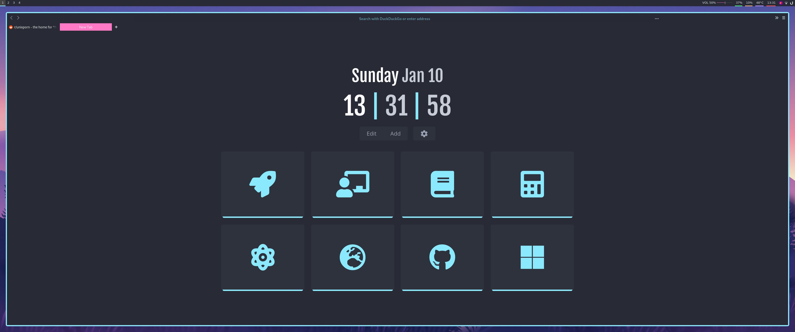
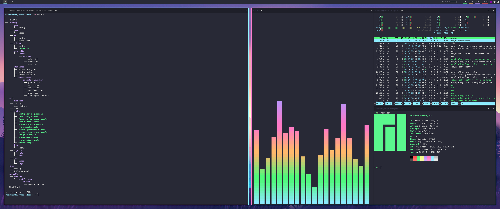
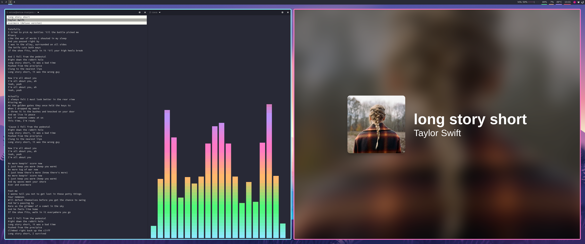
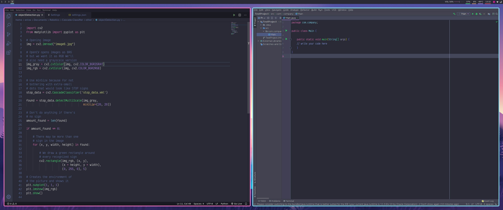

# DraculaRice
**Welcome**

**Dotfiles** for Customizing i3-gaps

## Preview

## Software

**Distro -** Manjaro XFCE

**WM -** [i3-gaps](https://github.com/Airblader/i3) 

**Compositor -** [Picom](https://github.com/ibhagwan/picom)

**Terminal -** [Tilix](https://github.com/gnunn1/tilix)

**App Launcher -** [ULauncher](https://github.com/Ulauncher/Ulauncher)

**File Browser -** Thunar

**Web Browser -** Firefox

* [Minimal Functional Fox](https://github.com/mut-ex/minimal-functional-fox)
* [nightTab](https://addons.mozilla.org/en-US/firefox/addon/nighttab/)

**Fetch -** [Neofetch](https://github.com/dylanaraps/neofetch)

**Music Player -** Spotify/[Spicetify](https://github.com/khanhas/spicetify-cli)

* fullAppDisplay.js
* [Dracula Theme](https://github.com/morpheusthewhite/spicetify-themes)

## Previewed Apps

[**lyrics-in-terminal**](https://github.com/Jugran/lyrics-in-terminal)

[**cava**](https://github.com/karlstav/cava)

[**tetris**](https://github.com/samtay/tetris)

[**htop**](https://github.com/htop-dev/htop)